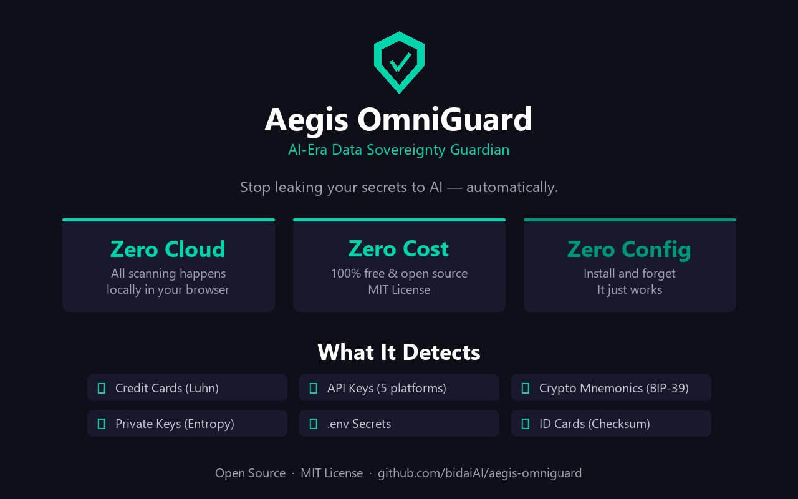
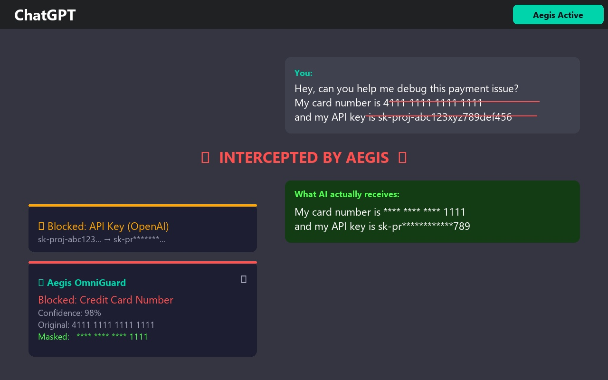
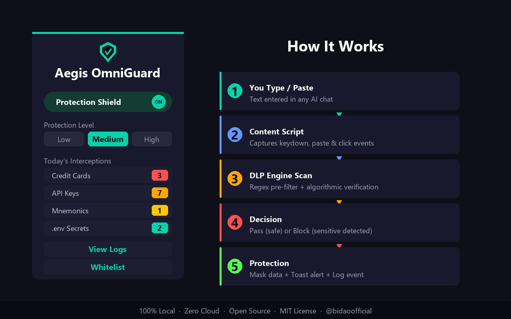

<div align="center">

# Aegis OmniGuard

### AI-Era Data Sovereignty Guardian | AI 时代数据主权守护者

🛡️ **You're leaking secrets to AI right now. You just don't know it yet.**

🛡️ **你正在向 AI 泄露秘密，只是你还不知道。**

[](LICENSE)
[](https://chromewebstore.google.com/detail/aegis-omniguard/fcgceeldnoifbaffonoaicbbcncfkjgg)
[]()
[]()
[]()
[](https://x.com/bidaoofficial)

🌐 **Website:** [aegis-web4.com](https://aegis-web4.com) | 🏪 **Chrome Store:** [Install Free](https://chromewebstore.google.com/detail/aegis-omniguard/fcgceeldnoifbaffonoaicbbcncfkjgg) | 🐦 **Twitter:** [@bidaoofficial](https://x.com/bidaoofficial)

[Install](#install) | [How It Works](#how-it-works) | [中文说明](#chinese)

</div>

---

## Why You Need This — Right Now

Think about the last time you pasted something into ChatGPT, Claude, or Cursor. Did you check for:

- A credit card number hiding in a support ticket?
- An API key (`sk-proj-...`, `AKIA...`) in your debug output?
- A crypto mnemonic phrase in your notes?
- A `.env` file with `DATABASE_URL=...` in your code?

**If you use any AI tool, you are a target.** Not because someone is attacking you — because you're handing your data away voluntarily, one paste at a time.

The numbers are real: 23M+ secrets leaked to public GitHub repos in 2024. 900K+ users had ChatGPT conversations stolen. 48% of AI-generated code contains vulnerabilities.

**Aegis OmniGuard is the seatbelt for the AI era.** It sits between your keyboard and the cloud, scanning everything locally in your browser before it leaves. When it finds sensitive data, it blocks it — instantly, silently, locally.

- **Zero cloud** — nothing leaves your machine
- **Zero cost** — 100% free, forever
- **Zero trust required** — 100% open source, read every line yourself
- **Zero setup** — install and forget, it just works

> **If you wouldn't shout your API key in a crowded room, you shouldn't paste it into an AI chatbot.** Aegis OmniGuard makes sure you never do — even by accident.

---

## Features

### Web2 DLP Shield (Phase 1 - Available Now)

| Detection | Method | False Positive Prevention |
|-----------|--------|--------------------------|
| Credit Cards | Regex + **Luhn algorithm** | Random 16-digit numbers pass through |
| Crypto Mnemonics | **BIP-39 wordlist** (2048 words) | Normal 12-word sentences pass through |
| Private Keys | Hex pattern + **Shannon entropy** | Low-entropy hex strings pass through |
| OpenAI Keys | `sk-proj-...` / `sk-...` pattern | Near-zero false positives |
| Anthropic Keys | `sk-ant-...` pattern | High confidence |
| AWS Keys | `AKIA...` pattern | High confidence |
| GitHub Tokens | `ghp_...` / `gho_...` pattern | High confidence |
| Google AI Keys | `AIza...` pattern | High confidence |
| `.env` Secrets | `API_KEY=...` pattern | Requires KEY=VALUE format |
| Chinese ID Cards | 18-digit + **checksum validation** | Invalid checksums pass through |
| Phone Numbers | Chinese mobile pattern | Basic format check |
| Email Addresses | Standard email regex | Standard |

### Key Technical Innovations

- **React/Vue State Sync**: Native `HTMLInputElement.prototype.value` setter override + `dispatchEvent` — frameworks see the masked value, not the original
- **contenteditable Support**: Works with ChatGPT/Claude's modern chat UIs, not just `<textarea>`
- **Shadow DOM Isolation**: Injected UI wrapped in Shadow DOM — zero CSS conflicts
- **Two-Pass Detection**: Fast regex pre-filter → algorithmic verification (Luhn/BIP-39/entropy) to kill false positives
- **Submit Button Interception**: Catches send buttons across AI platforms
- **Protection Levels**: Low (0.95) / Medium (0.80) / High (0.60) confidence thresholds

### Multi-Chain Private Key Detection (Phase 2 - v0.2.0)

| Chain | Format | Verification |
|-------|--------|-------------|
| Bitcoin | WIF (`5`/`K`/`L` prefix) | Base58Check + SHA-256 double hash |
| Solana | Base58 keypair/seed | 64-byte keypair / 32-byte seed length validation |
| Tron | 64-char hex | Shannon entropy analysis (rejects tx hashes) |
| Ethereum | `0x` + 64 hex | Entropy threshold |
| BIP-39 Mnemonic (EN) | 12/24 English words | Full 2048-word dictionary check |
| BIP-39 Mnemonic (CN) | 12/24 Chinese chars | Async lazy-load 2048 Simplified Chinese wordlist |

61 test cases passing, including false-positive prevention for tx hashes, contract addresses, and random Base58 strings.

### Web3 Sentinel (Phase 2 - v0.2.0)

Intercepts wallet interactions **before** MetaMask popup — between your click and the signature:

| Method | Risk | Action |
|--------|------|--------|
| `eth_sendTransaction` | Decode contract call | Detect `approve()`, `setApprovalForAll()`, unlimited approvals |
| `eth_signTypedData_v4` | Permit signature | Detect EIP-2612 Permit (off-chain token drain) |
| `personal_sign` | Message signing | Warn about phishing potential |
| `eth_sign` | Raw hash signing | **Block by default** — can sign anything |

**Two-tier analysis:**
- **Tier 1 (Local)**: Zero-latency pre-screen with 14 known dangerous method selectors + unlimited approval detection
- **Tier 2 (LLM)**: Optional AI-powered contract audit via your own API key

**BYOK (Bring Your Own Key):**
- Supports OpenAI (gpt-4o-mini) / Anthropic (claude-haiku-4) / DeepSeek
- API keys encrypted with AES-256-GCM, never leave the extension
- All LLM calls routed through Background Service Worker

### i18n — EN / Chinese Toggle (Phase 2 - v0.2.0)

- Zero-dependency React Context i18n system
- 93 translation keys across all 4 popup pages
- One-click `EN | 中` toggle in Dashboard header
- Language preference persisted to settings

---

<a name="install"></a>
## Install

### Chrome Web Store (Recommended for everyone)

> **Submitted for review!** Search **"Aegis OmniGuard"** in Chrome Web Store in a few days (typically 1-3 business days for approval).
>
> Direct link (available after approval): [Chrome Web Store - Aegis OmniGuard](https://chrome.google.com/webstore/detail/aegis-omniguard)
>
> Don't want to build from source? Just wait for the Chrome Web Store version — one-click install, auto-updates included!

### Manual Install (30 seconds, for developers)

**Option A: Download Release (No coding needed)**

1. Go to [Releases](../../releases) → download `aegis-omniguard-vX.X.X.zip`
2. Unzip
3. Chrome → `chrome://extensions/` → Enable **Developer mode** (top-right)
4. **Load unpacked** → select the unzipped folder
5. Done. The shield icon appears in your toolbar.

**Option B: Build from Source**

```bash
git clone https://github.com/bidaiAI/aegis-omniguard.git
cd aegis-omniguard
npm install
npm run build
```

Load `dist/` in Chrome as above.

---

<a name="how-it-works"></a>
## How It Works

```
You type/paste text in ChatGPT / Claude / Cursor / any website
       |
       v
[Content Script] captures keydown / paste / click events
       |
       v
[Background Worker] runs DLP engine:
  |
  +-- Regex pre-filter (fast scan)
  |     +-- Credit card?    --> Luhn algorithm   --> Pass/Block
  |     +-- 12+ words?      --> BIP-39 wordlist  --> Pass/Block
  |     +-- sk-proj-...?    --> Direct match     --> Block
  |     +-- 64 hex chars?   --> Entropy check    --> Pass/Block
  |     +-- API_KEY=...?    --> ENV pattern       --> Block
  |
  v
[Result]
  +-- PASS: Text goes through normally
  +-- BLOCK: Masked + toast notification + logged
```

### Architecture

```
[Chrome Extension - Manifest V3]
  |
  +-- Content Script (Isolated World)
  |     +-- DOM monitoring, event interception
  |     +-- Native setter override for React/Vue state sync
  |     +-- Shadow DOM toast injection
  |     +-- Bridge: relay Web3 intercepts to background
  |
  +-- Injected Script (Main World)               [NEW v0.2]
  |     +-- ES6 Proxy hijack window.ethereum.request()
  |     +-- Promise suspension with 5-min timeout
  |     +-- Shadow DOM AlertPanel (safe/warning/danger)
  |
  +-- Background Service Worker
  |     +-- DLP Engine: Luhn, BIP-39, entropy, regex
  |     +-- Multi-chain key detection (BTC/SOL/TRON/ETH)  [NEW v0.2]
  |     +-- Sentinel Engine: local pre-screen + LLM       [NEW v0.2]
  |     +-- LLM Proxy: BYOK routing (OpenAI/Anthropic/DeepSeek) [NEW v0.2]
  |     +-- Key Vault: AES-256-GCM encrypted storage      [NEW v0.2]
  |     +-- Settings management + whitelist
  |     +-- Intercept logging
  |
  +-- Popup UI (React + Tailwind)
        +-- Dashboard / Logs / Whitelist
        +-- Settings (BYOK provider management)    [NEW v0.2]
        +-- i18n: EN / 中 toggle (93 keys)         [NEW v0.2]
```

---

## Configuration

Click the Aegis shield icon:

- **Protection Shield**: Master on/off
- **Protection Level**: Low / Medium (recommended) / High
- **Web2 DLP Shield**: Toggle clipboard/paste interception
- **Web3 Sentinel**: Toggle transaction/signature interception
- **Whitelist**: Trusted domains where scanning is disabled
- **Intercept Log**: Review what was blocked
- **Settings**: Configure LLM provider (OpenAI/Anthropic/DeepSeek) and API keys
- **EN / 中**: Language toggle (top-right corner)

---

## Blocked but Need to Proceed? (FAQ)

**Q: Aegis blocked my input, but I actually need to enter this data. What do I do?**

You have three options:

1. **Whitelist the site** — Click the shield icon → **Whitelist** tab → add the domain you trust. That site will no longer be scanned.
2. **Lower the protection level** — Click the shield icon → change **Protection Level** from High to Medium or Low. Lower levels only block high-confidence matches.
3. **Temporarily disable** — Click the shield icon → turn off the **Protection Shield** toggle. Remember to turn it back on when you're done.

**Q: I need to enter my credit card number on a payment page. Will Aegis block it?**

Yes, by default Aegis will flag credit card numbers on any site. For legitimate payment pages: add the payment site to your **Whitelist**, or temporarily toggle off protection. Turn it back on after you're done.

**Q: How do I switch to Chinese?**

Click the `EN | 中` toggle in the top-right corner of the popup. All 4 pages switch instantly. Your preference is saved automatically.

**Q: How does the Web3 Sentinel work?**

It works out of the box with Tier 1 local analysis (zero config). For AI-powered deep analysis (Tier 2), go to Settings → choose a provider (OpenAI/Anthropic/DeepSeek) → enter your API key → Save. Keys are encrypted with AES-256-GCM locally.

---

## Privacy & Security

- **All scanning happens locally.** Zero data sent to any server. Ever.
- **No telemetry, no analytics, no tracking.** Period.
- **100% open source.** You don't need to trust us — just read the code.

---

## Development

```bash
npm install          # Install dependencies
npm run dev          # Dev build with hot reload
npm run build        # Production build
npx tsc -b           # Type check
npx tsx test/dlp_engine.test.ts  # Run tests (61 passing)
```

### Project Structure

```
src/
  background/      Service Worker (message routing, DLP dispatch, LLM proxy)
  content/         Content Script (DOM monitoring, event interception, bridge)
  engines/         DLP Engine, Sentinel Engine, wallet detector, code stripper
  inject/          Main World: ES6 Proxy hijack window.ethereum
  popup/           Popup UI (Dashboard, Logs, Whitelist, Settings, i18n)
  overlay/         Shadow DOM host management
  shared/          Types, constants, message protocol, key vault
  assets/          BIP-39 wordlists (English embedded, Chinese lazy-load)
test/              61 test cases (DLP + multi-chain + false positive control)
```

---

## Roadmap

- [x] **Phase 1 (v0.1.0)**: Web2 DLP Shield (local scanning, zero cloud)
- [x] **Phase 2 (v0.2.0)**: Web3 Sentinel + Multi-chain detection + BYOK + i18n
- [ ] **Phase 3**: Cross-chain bridge monitoring, phishing URL database
- [ ] **Phase 4**: Enterprise features (team management, advanced rules)
- [ ] VS Code / Cursor extension
- [ ] Firefox support

---

## Contributing

Contributions welcome! Areas where help is needed:

- Additional API key patterns (Azure, Stripe, Twilio, etc.)
- DLP rules for more languages and regions
- Browser compatibility testing
- UI/UX improvements
- Translations

---

## License

[MIT](LICENSE) — Free forever. Use it, fork it, ship it.

---

## Support the Project | 支持项目

This is a passion project built with love, not profit. If Aegis OmniGuard has protected your data and you'd like to support continued development — more interception rules, deeper security features, and a safer AI experience for everyone — any contribution is appreciated.

这是一个为爱发电的项目。如果 Aegis OmniGuard 保护了你的数据，也欢迎捐赠支持后续开发——更多拦截规则、更深层的安全防护功能、为大家打造更安全的 AI 使用环境。每一份支持都是继续前进的动力。

**ETH/EVM**: `0xf1c1ef080e6aE6AABA999ba6E5D1545cD5Efab41`

**Twitter/X**: [@bidaoofficial](https://x.com/bidaoofficial)

---

<a name="chinese"></a>

<div align="center">

# 中文说明

</div>

## 界面预览与使用指南

### 产品总览



> **三零理念：零上云（所有扫描在本地完成）、零费用（完全免费开源）、零配置（安装即用）。**
> 支持检测：信用卡号（Luhn 校验）、API 密钥（5 大平台）、加密货币助记词（BIP-39）、私钥（熵值检测）、.env 配置文件、身份证号（校验码验证）。

---

### 拦截效果演示



> **实际拦截效果：** 当你在 ChatGPT 中输入包含信用卡号和 API Key 的内容时，Aegis 会自动拦截并脱敏。
>
> 图片说明：
> - **上方红色删除线**：你输入的原始内容（包含真实信用卡号和 API Key）
> - **左下角拦截通知**：显示被拦截的类型（API Key / 信用卡号）、置信度（98%）、以及脱敏后的结果
> - **右侧绿色框**：AI 实际收到的内容——信用卡号已变成 `**** **** **** 1111`，API Key 已变成 `sk-pr**********789`
>
> **你的敏感数据从未离开浏览器。AI 只看到脱敏后的安全版本。**

---

### 控制面板与工作流程



> **左侧 - 插件控制面板（点击工具栏盾牌图标打开）：**
>
> | 界面元素 | 中文说明 |
> |---------|---------|
> | Protection Shield `ON` | 防护总开关（绿色 = 已开启） |
> | Protection Level: Low / **Medium** / High | 防护等级（推荐选 Medium） |
> | Today's Interceptions | 今日拦截统计 |
> | Credit Cards: 3 | 已拦截 3 次信用卡号 |
> | API Keys: 7 | 已拦截 7 次 API 密钥 |
> | Mnemonics: 1 | 已拦截 1 次助记词 |
> | .env Secrets: 2 | 已拦截 2 次环境变量密钥 |
> | View Logs | 查看拦截日志（详细记录每次拦截） |
> | Whitelist | 白名单管理（添加不需要扫描的信任网站） |
>
> **右侧 - 工作流程（5 步自动完成，无需手动操作）：**
> 1. **You Type / Paste** — 你在任意 AI 聊天界面输入或粘贴文本
> 2. **Content Script** — 插件捕获键盘、粘贴、点击事件
> 3. **DLP Engine Scan** — DLP 引擎执行正则预筛 + 算法校验
> 4. **Decision** — 判定：安全则放行（Pass），敏感则拦截（Block）
> 5. **Protection** — 自动脱敏 + 弹出提示通知 + 记录日志

---

## 为什么你现在就需要它

回想一下，你上次往 ChatGPT、Claude 或 Cursor 里粘贴内容的时候，有没有检查过：

- 客服工单里藏着的信用卡号？
- 调试输出中的 API 密钥（`sk-proj-...`、`AKIA...`）？
- 笔记中的加密货币助记词？
- 代码里带 `DATABASE_URL=...` 的 `.env` 文件？

**只要你使用任何 AI 工具，你就是潜在的泄露者。** 不是因为有人在攻击你——而是你自己在一次次粘贴中主动交出数据。

真实数据：2024 年 2300 万+ 密钥泄露到公开 GitHub 仓库。90 万+ 用户的 ChatGPT 对话被恶意插件窃取。48% 的 AI 生成代码包含安全漏洞。

**Aegis OmniGuard 是 AI 时代的安全带。** 它驻守在你的键盘和云端之间，在数据离开浏览器之前，本地扫描一切。发现敏感数据，立即拦截——即时、静默、纯本地。

- **零上云** — 数据不离开你的电脑
- **零费用** — 100% 免费，永远免费
- **零信任** — 100% 开源，每一行代码都可以自己审计
- **零配置** — 安装即用，无需设置

> **如果你不会在公共场合大喊你的 API 密钥，你也不应该把它粘贴给 AI 聊天机器人。** Aegis OmniGuard 确保你永远不会——即使是意外。

---

## 功能特性

### Web2 数据防泄露盾（第一阶段 - 已发布）

| 检测类型 | 方法 | 防误报机制 |
|----------|------|-----------|
| 信用卡号 | 正则 + **Luhn 算法** | 随机16位数字不会误报 |
| 加密货币助记词 | **BIP-39 词表**（2048 词） | 普通12词句子不会误报 |
| 私钥 | 十六进制模式 + **香农熵** | 低熵十六进制串不会误报 |
| OpenAI 密钥 | `sk-proj-...` / `sk-...` 模式 | 近零误报 |
| Anthropic 密钥 | `sk-ant-...` 模式 | 高置信度 |
| AWS 密钥 | `AKIA...` 模式 | 高置信度 |
| GitHub Token | `ghp_...` / `gho_...` 模式 | 高置信度 |
| Google AI 密钥 | `AIza...` 模式 | 高置信度 |
| `.env` 配置 | `API_KEY=...` 模式 | 需要 KEY=VALUE 格式 |
| 中国身份证号 | 18位 + **校验码验证** | 无效校验码不会误报 |
| 手机号 | 中国手机号模式 | 基本格式校验 |
| 邮箱地址 | 标准邮箱正则 | 标准 |

### 核心技术亮点

- **React/Vue 状态同步**：通过原生 setter 覆写 + dispatchEvent，确保框架内部状态同步更新
- **contenteditable 支持**：适配 ChatGPT/Claude 的现代聊天界面，而不仅仅是传统 `<textarea>`
- **Shadow DOM 隔离**：注入的 UI 完全隔离，与页面零 CSS 冲突
- **两遍检测**：快速正则预筛 → 算法验证（Luhn/BIP-39/熵值），消灭误报
- **发送按钮拦截**：跨平台捕获发送按钮点击
- **防护等级**：低（0.95）/ 中（0.80）/ 高（0.60）置信度阈值

### 多链私钥检测（第二阶段 - v0.2.0 已发布）

| 链 | 格式 | 验证方式 |
|----|------|---------|
| Bitcoin | WIF (`5`/`K`/`L` 开头) | Base58Check + SHA-256 双重哈希 |
| Solana | Base58 密钥对/种子 | 64字节/32字节长度验证 |
| Tron | 64位 hex | Shannon 熵值分析（排除交易哈希误报） |
| Ethereum | `0x` + 64位 hex | 熵值阈值 |
| BIP-39 助记词 (英文) | 12/24 英文单词 | 完整 2048 词库校验 |
| BIP-39 助记词 (中文) | 12/24 汉字 | 异步加载 2048 简体中文词库 |

61 个测试用例全部通过，含交易哈希、合约地址、随机 Base58 字符串的误报防控。

### Web3 哨兵（第二阶段 - v0.2.0 已发布）

在你点击 DApp「确认」按钮之后、MetaMask 弹窗之前，自动拦截并分析：

| 方法 | 风险 | 动作 |
|------|------|------|
| `eth_sendTransaction` | 解码合约调用 | 识别 `approve()`、`setApprovalForAll()`、无限授权 |
| `eth_signTypedData_v4` | Permit 签名 | 检测 EIP-2612 Permit（离线盗币） |
| `personal_sign` | 消息签名 | 提醒钓鱼风险 |
| `eth_sign` | 原始哈希签名 | **默认阻止** — 可签署任意数据 |

**两层分析引擎：**
- **Tier 1（本地）**：零延迟预判，内置 14 种危险方法签名 + 无限授权检测
- **Tier 2（LLM）**：可选 AI 合约审计，接入你自己的 API Key

**BYOK（自带密钥）：**
- 支持 OpenAI (gpt-4o-mini) / Anthropic (claude-haiku-4) / DeepSeek
- API 密钥以 AES-256-GCM 加密存储，永不离开扩展
- 所有 LLM 调用走后台 Service Worker 代理

### 中英双语切换（第二阶段 - v0.2.0 已发布）

- 零依赖 React Context i18n 系统
- 93 个翻译字段覆盖全部 4 个页面
- Dashboard 右上角 `EN | 中` 一键切换
- 语言偏好持久化保存

---

## 安装

### Chrome 应用商店（所有人推荐）

> **已提交审核！** 预计 1-3 个工作日内通过。届时在 Chrome 应用商店搜索 **「Aegis OmniGuard」** 即可一键安装。
>
> 直达链接（审核通过后可用）：[Chrome 应用商店 - Aegis OmniGuard](https://chrome.google.com/webstore/detail/aegis-omniguard)
>
> 不想折腾代码？等 Chrome 应用商店版本就行 — 一键安装，自动更新！

### 手动安装（30 秒，适合开发者）

**方式 A：下载安装包（无需编程）**

1. 前往 [Releases](../../releases) → 下载 `aegis-omniguard-vX.X.X.zip`
2. 解压
3. Chrome → `chrome://extensions/` → 开启右上角 **开发者模式**
4. 点击 **加载已解压的扩展程序** → 选择解压后的文件夹
5. 完成！工具栏出现盾牌图标。

**方式 B：从源码构建**

```bash
git clone https://github.com/bidaiAI/aegis-omniguard.git
cd aegis-omniguard
npm install
npm run build
```

然后按上述方式在 Chrome 中加载 `dist/` 文件夹。

---

## 配置

点击工具栏的 Aegis 盾牌图标：

- **防护开关**：主开关
- **防护等级**：低 / 中（推荐）/ 高
- **Web2 数据防泄盾**：开关粘贴板/输入拦截
- **Web3 哨兵**：开关交易/签名拦截
- **白名单**：添加不扫描的信任域名
- **拦截日志**：查看被拦截的内容
- **设置**：配置 LLM 服务商（OpenAI/Anthropic/DeepSeek）和 API 密钥
- **EN / 中**：语言切换（右上角）

---

## 被拦截了怎么办？(FAQ)

**Q: 插件把我的输入拦截了，但我确实需要输入这个内容怎么办？**

有以下几种方式：

1. **添加白名单** — 点击工具栏盾牌图标 → **Whitelist** 标签 → 添加你信任的网站域名。该网站将不再被扫描。
2. **降低防护等级** — 点击盾牌图标 → 将 **Protection Level** 从 High 调为 Medium 或 Low。等级越低，只有高置信度的敏感数据才会被拦截。
3. **临时关闭** — 点击盾牌图标 → 关闭 **Protection Shield** 开关。完成操作后记得重新打开。

**Q: 界面各按钮是什么意思？**

v0.2.0 已支持中文界面（点右上角 `EN | 中` 切换）。如果使用英文界面：

| 英文 | 中文含义 |
|------|---------|
| Protection Shield | 防护总开关（ON=开启 / OFF=关闭） |
| Protection Level: Low / Medium / High | 防护等级：低 / 中 / 高 |
| Web2 DLP Shield | Web2 数据防泄盾（粘贴板拦截） |
| Web3 Sentinel | Web3 哨兵（交易签名拦截） |
| Whitelist | 白名单（添加信任的网站，不扫描） |
| Intercept Log | 拦截日志（查看被拦截的记录） |
| Settings | 设置（LLM 服务商和 API 密钥管理） |
| Add Domain | 添加域名 |
| Clear Logs | 清空日志 |

**Q: 我就是要填信用卡号付款，怎么办？**

在正规支付页面填写信用卡号时：将该支付网站加入白名单，或者临时关闭防护开关。完成支付后建议重新开启防护。

**Q: 怎么切换中文界面？**

v0.2.0 已支持！点击 Popup 右上角的 `EN | 中` 按钮即可一键切换，所有页面立即变为中文。语言偏好会自动保存。

**Q: Web3 哨兵怎么用？需要配置什么吗？**

安装后即可使用基础防护（Tier 1 本地分析）。如果想开启 AI 深度分析（Tier 2），点击「设置」→ 选择服务商（OpenAI/Anthropic/DeepSeek）→ 输入你的 API Key → 保存。密钥以 AES-256-GCM 加密存储在本地。

---

## 隐私与安全

- **所有扫描纯本地执行。** 零数据发送到任何服务器。
- **无遥测、无分析、无追踪。**
- **100% 开源。** 不需要信任我们——自己看代码。

---

## 路线图

- [x] **第一阶段 (v0.1.0)**：Web2 数据防泄露盾（本地扫描，零上云）
- [x] **第二阶段 (v0.2.0)**：Web3 哨兵 + 多链私钥检测 + BYOK + 中英双语
- [ ] **第三阶段**：跨链桥监控、钓鱼 URL 数据库
- [ ] **第四阶段**：企业功能（团队管理，高级规则）
- [ ] VS Code / Cursor 插件
- [ ] Firefox 支持

---

<div align="center">

**为 AI 时代而生。因为你的数据，只属于你。**

**Built for the AI era. Because your data is yours.**

[Report Bug / 报告问题](../../issues) | [Request Feature / 功能建议](../../issues) | [Security / 安全问题](SECURITY.md)

**Twitter/X**: [@bidaoofficial](https://x.com/bidaoofficial)

**ETH/EVM Donation (为爱发电)**: `0xf1c1ef080e6aE6AABA999ba6E5D1545cD5Efab41`

</div>
